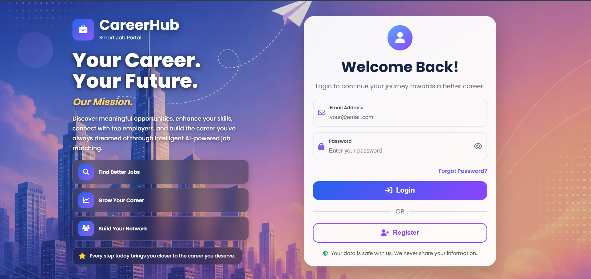
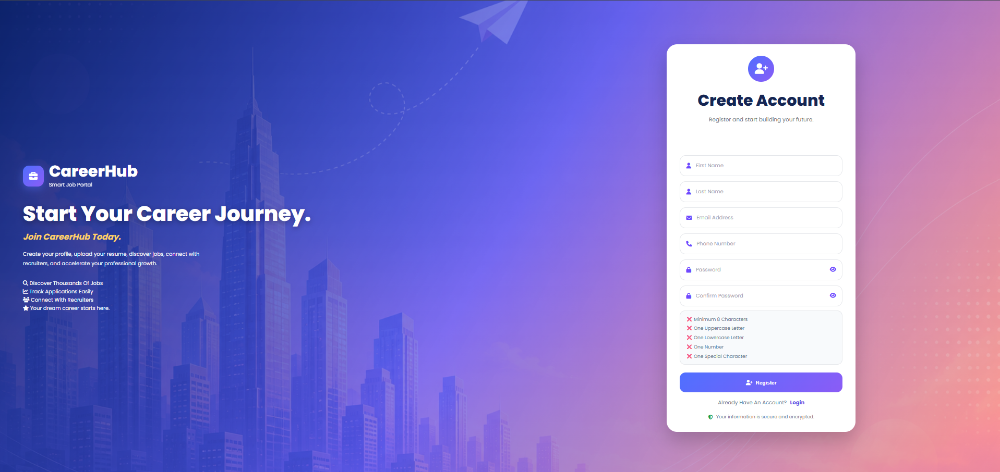
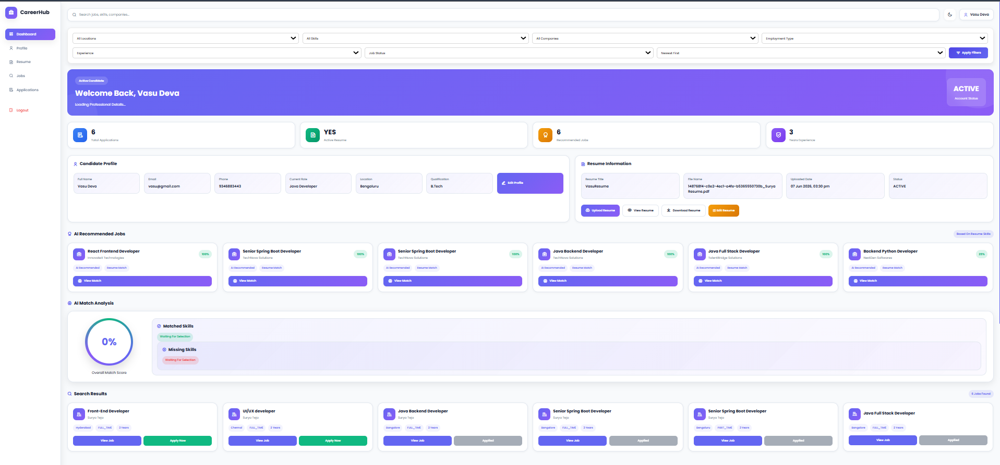
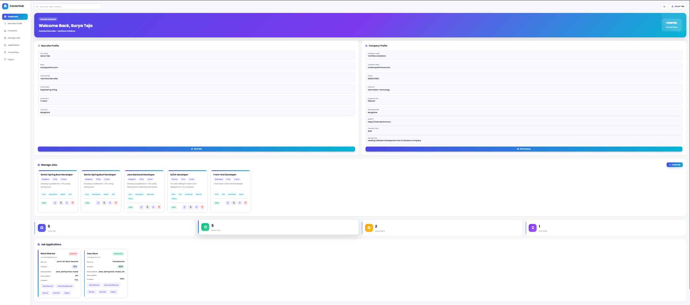
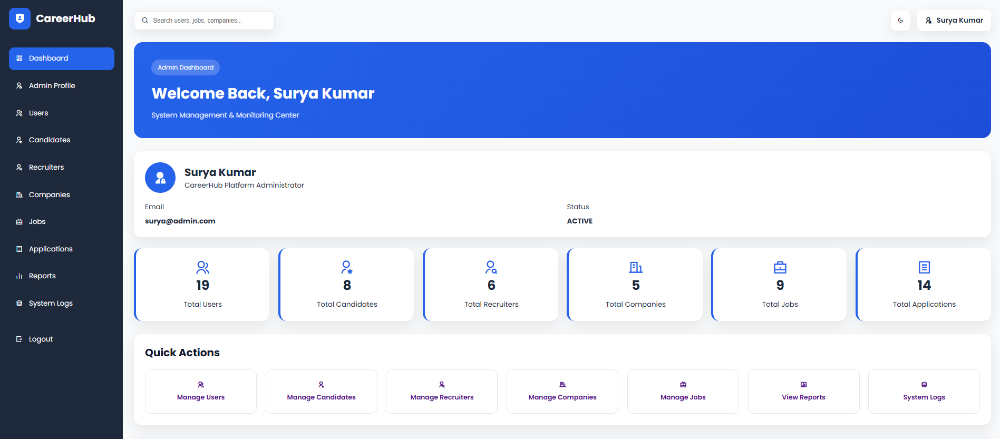

# 🚀 CareerHub Smart Job Portal

### AI-Powered Enterprise Recruitment Platform Built with Spring Boot

A modern enterprise-level Job Portal that streamlines the recruitment process by connecting Candidates, Recruiters, and Administrators on a secure platform with AI-powered Resume Matching, Resume Parsing, JWT Authentication, and Role-Based Access Control.

---

# 📌 Project Overview

**CareerHub Smart Job Portal** is a full-stack enterprise-level recruitment platform developed using **Java, Spring Boot, Spring Security, Spring Data JPA, Hibernate, MySQL, HTML, CSS, and JavaScript**.

The platform digitalizes and simplifies the complete hiring lifecycle by enabling secure collaboration between **Candidates**, **Recruiters**, and **Administrators**.

Unlike traditional job portals, CareerHub integrates **AI-powered Resume Matching** and **Resume Parsing** to intelligently evaluate candidate profiles against job requirements, helping recruiters identify the most suitable applicants quickly and efficiently.

The application follows a **Layered MVC Architecture**, implements **RESTful APIs**, and secures every request using **JWT-based Authentication** with **Role-Based Authorization**.

---

# ✨ Key Highlights

- 🔐 Secure JWT Authentication & Authorization
- 👥 Role-Based Access Control (Admin, Recruiter, Candidate)
- 🤖 AI Resume Matching Engine
- 📄 Automated Resume Parsing
- 💼 Job Posting & Job Management
- 📑 Job Application Management
- 🏢 Company Management
- 👨‍💼 Recruiter Dashboard
- 👨‍🎓 Candidate Dashboard
- 👨‍💻 Admin Dashboard
- 📂 Resume Upload & File Management
- 🔍 Advanced Job Search
- 📊 Candidate Profile Management
- 📈 Matching Score Calculation
- ⚡ RESTful APIs
- 🛡 Spring Security Integration
- 🗄 MySQL Database Integration
- 🎨 Responsive User Interface

---

# 🎯 Objectives

The primary objective of CareerHub is to build an intelligent recruitment platform capable of:

- Connecting candidates with recruiters efficiently.
- Automating resume screening.
- Reducing manual recruitment effort.
- Improving hiring accuracy using AI-based resume matching.
- Providing secure authentication and authorization.
- Managing complete recruitment workflows through a centralized system.

---

# 🌟 Core Features

## 👨‍🎓 Candidate Module

- Candidate Registration
- Secure Login
- JWT Authentication
- Profile Management
- Resume Upload
- Resume Update
- Education Management
- Experience Management
- Skills Management
- Search Jobs
- Apply Jobs
- View Applied Jobs
- Resume Matching Results
- Dashboard Analytics

---

## 👨‍💼 Recruiter Module

- Recruiter Registration
- Secure Login
- Company Management
- Recruiter Dashboard
- Create Jobs
- Update Jobs
- Delete Jobs
- View Applications
- Review Candidate Profiles
- View AI Matching Scores
- Shortlist Candidates

---

## 👨‍💻 Admin Module

- Admin Authentication
- Dashboard
- User Management
- Candidate Management
- Recruiter Management
- Company Management
- Job Monitoring
- Resume Monitoring
- Audit Logs
- System Administration

---

## 🤖 AI Resume Matching Module

- Resume Parsing
- Skill Extraction
- Job Skill Comparison
- Matching Percentage Calculation
- Recommendation Engine
- Candidate Ranking

---

## 🔐 Security Features

- Spring Security
- JWT Authentication
- Role-Based Authorization
- Password Encryption
- Protected REST APIs
- Authentication Filter
- Access Validation
- Secure File Upload

---

# 🚀 Major Functional Modules

- Authentication Module
- User Management Module
- Candidate Profile Module
- Recruiter Module
- Company Module
- Job Management Module
- Resume Upload Module
- Resume Parsing Module
- AI Resume Matching Module
- Job Application Module
- Search & Filtering Module
- Dashboard Module
- Notification Module
- Validation Module
- Exception Handling Module

---

# 💡 Why CareerHub?

CareerHub is designed as a portfolio-quality enterprise application that demonstrates real-world software engineering practices including:

- Layered Architecture
- MVC Design Pattern
- REST API Development
- Secure Authentication
- Database Design
- Object Relational Mapping (ORM)
- File Handling
- AI-Based Matching Logic
- Clean Code Principles
- Scalable Backend Development

This project serves as a complete showcase of modern Java Full Stack Development skills.

---

# 📈 Project Status

| Status | Description |
|----------|------------|
| ✅ Backend Development | Completed |
| ✅ Database Design | Completed |
| ✅ Spring Security | Completed |
| ✅ JWT Authentication | Completed |
| ✅ Resume Upload | Completed |
| ✅ Resume Parsing | Completed |
| ✅ AI Resume Matching | Completed |
| ✅ REST APIs | Completed |
| ✅ Candidate Dashboard | Completed |
| ✅ Recruiter Dashboard | Completed |
| ✅ Admin Dashboard | Completed |
| 🚀 GitHub Deployment | Completed |

---

---

# 🛠️ Technology Stack

CareerHub Smart Job Portal is developed using modern Java Full Stack technologies and follows enterprise software development practices.

## 💻 Backend

| Technology | Purpose |
|------------|---------|
| Java 17 | Core Programming Language |
| Spring Boot | Backend Application Framework |
| Spring MVC | MVC Architecture |
| Spring Security | Authentication & Authorization |
| Spring Data JPA | Database Access Layer |
| Hibernate ORM | Object Relational Mapping |
| JWT | Secure Authentication |
| Maven | Dependency Management & Build Tool |

---

## 🎨 Frontend

| Technology | Purpose |
|------------|---------|
| HTML5 | Structure of Web Pages |
| CSS3 | User Interface Design |
| JavaScript | Client-Side Functionality |

---

## 🗄️ Database

| Technology | Purpose |
|------------|---------|
| MySQL | Relational Database Management System |

---

## 🧰 Development Tools

| Tool | Purpose |
|------|---------|
| Eclipse IDE | Java Development |
| MySQL Workbench | Database Management |
| Postman | REST API Testing |
| Git | Version Control |
| GitHub | Source Code Repository |

---

# 🏗️ System Architecture

CareerHub follows a layered architecture that separates responsibilities into independent layers, making the application scalable, maintainable, and easy to extend.

```
                    +----------------------+
                    |      Frontend        |
                    | HTML • CSS • JS      |
                    +----------+-----------+
                               |
                               |
                    REST API Requests
                               |
                               ▼
                    +----------------------+
                    |   Controller Layer   |
                    +----------+-----------+
                               |
                               ▼
                    +----------------------+
                    |    Service Layer     |
                    +----------+-----------+
                               |
                               ▼
                    +----------------------+
                    | Repository Layer     |
                    | Spring Data JPA      |
                    +----------+-----------+
                               |
                               ▼
                    +----------------------+
                    |       MySQL          |
                    +----------------------+
```

---

# 📂 Project Structure

```
CareerHub-Smart-Job-Portal
│
├── src
│   ├── main
│   │   ├── java
│   │   │   └── com.smartjobportal
│   │   │       ├── admin
│   │   │       ├── application
│   │   │       ├── candidate
│   │   │       ├── company
│   │   │       ├── config
│   │   │       ├── controller
│   │   │       ├── dto
│   │   │       ├── entity
│   │   │       ├── exception
│   │   │       ├── job
│   │   │       ├── matching
│   │   │       ├── recruiter
│   │   │       ├── repository
│   │   │       ├── resumeparser
│   │   │       ├── security
│   │   │       ├── service
│   │   │       └── user
│   │   │
│   │   └── resources
│   │       ├── static
│   │       │   ├── css
│   │       │   ├── html
│   │       │   ├── images
│   │       │   └── js
│   │       ├── templates
│   │       └── application.properties
│   │
│   └── test
│
├── pom.xml
├── mvnw
├── mvnw.cmd
└── README.md
```

---

# 🗄️ Database Overview

The project uses **MySQL** as the primary relational database.

The database is normalized to efficiently manage users, companies, jobs, applications, resumes, and AI matching results.

---

## 📊 Main Database Tables

| Table | Description |
|---------|------------|
| users | Stores authentication and user information |
| roles | Stores application roles |
| user_roles | Maps users with roles |
| candidate_profiles | Candidate personal information |
| recruiter_profiles | Recruiter details |
| companies | Company information |
| jobs | Job postings |
| job_skills | Required job skills |
| candidate_skills | Candidate technical skills |
| candidate_education | Education details |
| candidate_experience | Work experience |
| resumes | Resume metadata |
| job_applications | Candidate applications |
| ai_match_results | AI resume matching scores |
| job_matches | Recommended jobs |
| recommended_jobs | Personalized recommendations |
| notifications | User notifications |
| saved_jobs | Saved job list |
| admin_logs | Administrative activity logs |
| application_status_history | Application status tracking |

---

# 🔄 Application Workflow

```
Candidate Registration
          │
          ▼
Secure Login (JWT)
          │
          ▼
Complete Candidate Profile
          │
          ▼
Upload Resume
          │
          ▼
Resume Parsing
          │
          ▼
AI Resume Matching
          │
          ▼
Browse Available Jobs
          │
          ▼
Apply for Job
          │
          ▼
Recruiter Reviews Application
          │
          ▼
Candidate Shortlisting
          │
          ▼
Hiring Process
```

---

# 🔐 Authentication Flow

```
User Login
      │
      ▼
Authentication Request
      │
      ▼
Spring Security
      │
      ▼
JWT Token Generation
      │
      ▼
Token Returned to Client
      │
      ▼
Protected API Requests
      │
      ▼
JWT Validation Filter
      │
      ▼
Access Granted
```

---

# 📈 AI Resume Matching Workflow

```
Resume Upload
      │
      ▼
Resume Parsing
      │
      ▼
Skill Extraction
      │
      ▼
Job Skill Comparison
      │
      ▼
Matching Algorithm
      │
      ▼
Matching Percentage
      │
      ▼
Recommended Jobs
```

---

# 🔑 User Roles

The application provides three independent user roles.

## 👨‍💼 Administrator

- Manage all users
- Monitor recruiters
- Manage companies
- Manage jobs
- View system logs
- Monitor applications

---

## 👨‍💻 Recruiter

- Create job postings
- Update job postings
- Delete jobs
- Review applications
- View candidate profiles
- Shortlist candidates

---

## 👨‍🎓 Candidate

- Register account
- Manage profile
- Upload resume
- Search jobs
- Apply for jobs
- View application history
- View AI matching results

---

# 📌 Design Principles

The application follows industry-standard software engineering principles.

- Layered Architecture
- MVC Design Pattern
- Separation of Concerns
- Dependency Injection
- RESTful API Design
- Repository Pattern
- DTO Pattern
- Exception Handling
- Validation
- Secure Authentication
- Role-Based Authorization
- Clean Code Practices
- Modular Development

---

# 🚀 Getting Started

Follow the steps below to set up and run the CareerHub Smart Job Portal on your local machine.

---

# 📋 Prerequisites

Ensure the following software is installed before running the application.

| Software | Recommended Version |
|----------|----------------------|
| Java JDK | 17 or above |
| Eclipse IDE | 2024-03 or later |
| Apache Maven | 3.9+ |
| MySQL Server | 8.0+ |
| MySQL Workbench | Latest |
| Git | Latest |
| Postman | Latest |

---

# ⚙️ Installation

## Step 1: Clone the Repository

```bash
git clone https://github.com/Surya63023/careerhub-smart-job-portal.git
```

---

## Step 2: Navigate to the Project Directory

```bash
cd careerhub-smart-job-portal
```

---

## Step 3: Open the Project

Open Eclipse IDE

```
File
    ↓
Import
    ↓
Existing Maven Project
```

Select the cloned project folder.

---

## Step 4: Update Maven Dependencies

Right Click Project

```
Maven
    ↓
Update Project...
```

---

## Step 5: Create Database

Create a MySQL database.

```sql
CREATE DATABASE smart_job_portal_db;
```

---

## Step 6: Configure Database

Open

```
src/main/resources/application.properties
```

Update the database configuration.

```properties
spring.datasource.url=jdbc:mysql://localhost:3306/smart_job_portal_db

spring.datasource.username=YOUR_USERNAME

spring.datasource.password=YOUR_PASSWORD

spring.jpa.hibernate.ddl-auto=update

spring.jpa.show-sql=true
```

---

## Step 7: Run the Application

Run the Spring Boot application.

```
Right Click Project

Run As

Spring Boot App
```

If everything is configured correctly, the application starts successfully.

---

# 🌐 Default URLs

| Service | URL |
|----------|-----|
| Application | http://localhost:8080 |
| Login Page | http://localhost:8080/html/login.html |
| API Base URL | http://localhost:8080/api |

---

# 📡 REST API Overview

The application exposes RESTful APIs for all major modules.

---

## 🔐 Authentication APIs

| Method | Endpoint | Description |
|----------|----------|------------|
| POST | /api/auth/register | Register User |
| POST | /api/auth/login | User Login |

---

## 👨‍🎓 Candidate APIs

| Method | Endpoint |
|----------|----------|
| GET | /api/candidate/profile |
| PUT | /api/candidate/profile |
| GET | /api/candidate/jobs |
| POST | /api/candidate/apply |

---

## 👨‍💼 Recruiter APIs

| Method | Endpoint |
|----------|----------|
| POST | /api/recruiter/jobs |
| GET | /api/recruiter/jobs |
| PUT | /api/recruiter/jobs/{id} |
| DELETE | /api/recruiter/jobs/{id} |

---

## 💼 Job APIs

| Method | Endpoint |
|----------|----------|
| GET | /api/jobs |
| GET | /api/jobs/{id} |
| POST | /api/jobs |
| PUT | /api/jobs/{id} |
| DELETE | /api/jobs/{id} |

---

## 📄 Resume APIs

| Method | Endpoint |
|----------|----------|
| POST | /api/resume/upload |
| GET | /api/resume |
| DELETE | /api/resume/{id} |

---

## 🤖 AI Matching APIs

| Method | Endpoint |
|----------|----------|
| POST | /api/matching/start |
| GET | /api/matching/results |

---

# 🧪 API Testing

The backend APIs were tested using **Postman**.

The following scenarios have been verified:

- User Registration
- User Login
- JWT Authentication
- Candidate CRUD
- Recruiter CRUD
- Company CRUD
- Job CRUD
- Resume Upload
- Resume Parsing
- AI Resume Matching
- Job Application
- Search & Filtering
- Exception Handling

---

# 📁 File Upload Support

The application supports secure document upload.

Supported files include:

- PDF
- DOC
- DOCX

Uploaded resumes are parsed and processed by the AI Resume Matching module.

---

# 🔒 Security Features

CareerHub implements multiple security mechanisms.

- JWT Authentication
- Spring Security
- Password Encryption
- Role-Based Access Control
- Protected REST APIs
- Authentication Filters
- Secure File Upload
- Input Validation
- Global Exception Handling

---

# ⚡ Performance Highlights

- Layered Architecture
- Optimized Database Queries
- JPA Repository Pattern
- Modular Services
- Clean Code Structure
- Reusable Components
- Exception Handling
- DTO Mapping
- Validation
- Secure Authentication

---

# 📸 Application Screenshots

## 🔐 Login Page

The login page provides secure authentication using JWT-based login with role-based access control.



---

## 📝 Registration Page

New candidates and recruiters can create an account through the registration page with secure validation.



---

## 👨‍🎓 Candidate Dashboard

The Candidate Dashboard allows users to:

- Complete profile
- Upload resume
- Search jobs
- View recommended jobs
- Track applications



---

## 👨‍💼 Recruiter Dashboard

The Recruiter Dashboard provides recruiters with tools to:

- Post jobs
- Manage job listings
- Review candidates
- View applications
- Shortlist applicants



---

## 👨‍💻 Admin Dashboard

The Admin Dashboard enables complete system administration.

Features include:

- User Management
- Recruiter Management
- Company Management
- Job Monitoring
- Dashboard Analytics
- System Logs



---

# 🔮 Future Enhancements

The following features are planned for future releases.

- Email Notifications
- Interview Scheduling
- Video Interview Integration
- Company Reviews
- Candidate Resume Builder
- AI Interview Assistant
- AI Chatbot
- Resume Recommendation Engine
- Advanced Analytics Dashboard
- Docker Deployment
- AWS Cloud Deployment
- CI/CD Pipeline
- Elasticsearch Integration
- Redis Caching
- Microservices Migration

---

# 🤝 Contributing

Contributions are welcome.

If you would like to improve this project:

1. Fork the repository.
2. Create a feature branch.
3. Commit your changes.
4. Push the branch.
5. Open a Pull Request.

---

# 📄 License

This project is licensed under the **MIT License**.

---

# 👨‍💻 Author

## Surya Teja

Aspiring Java Full Stack Developer

### Connect with Me

**GitHub**

https://github.com/Surya63023

**Portfolio**

https://surya63023.github.io/surya-developer-portfolio/

**LinkedIn**

> Add your LinkedIn profile URL here.

---

# ⭐ Support

If you found this project helpful,

⭐ Star this repository

🍴 Fork the repository

🛠️ Contribute to the project

📢 Share it with others

---

# 🙏 Acknowledgements

Special thanks to the Java and Spring Boot community for providing excellent open-source frameworks and documentation that made the development of this project possible.

---

## Happy Coding! 🚀

---

# 🏛️ System Design

CareerHub Smart Job Portal follows a layered enterprise architecture that promotes maintainability, scalability, security, and separation of concerns.

```
                        Client Browser
                               │
                               │
                 HTML • CSS • JavaScript
                               │
                               ▼
                    Spring MVC Controllers
                               │
                               ▼
                       Service Layer
                               │
                               ▼
                   Spring Data JPA Layer
                               │
                               ▼
                         Hibernate ORM
                               │
                               ▼
                           MySQL Database
```

---

# 🧩 Software Design Principles

The project has been designed by following modern software engineering principles.

- SOLID Principles
- DRY (Don't Repeat Yourself)
- Separation of Concerns
- Layered Architecture
- Repository Pattern
- DTO Pattern
- Dependency Injection
- Object-Oriented Programming
- RESTful API Design
- Clean Code Practices

---

# 📁 Project Modules

The project consists of multiple independent business modules.

## 🔐 Authentication Module

Responsible for

- User Registration
- User Login
- JWT Token Generation
- Authentication
- Authorization
- Password Encryption

---

## 👤 User Management Module

Responsible for

- User Profile
- Roles
- Account Management

---

## 👨‍🎓 Candidate Module

Responsible for

- Candidate Profile
- Skills
- Education
- Experience
- Resume Upload
- Job Search
- Job Applications

---

## 👨‍💼 Recruiter Module

Responsible for

- Recruiter Profile
- Company Profile
- Job Posting
- Job Management
- Candidate Review

---

## 🏢 Company Module

Responsible for

- Company Information
- Recruiter Mapping
- Company Management

---

## 💼 Job Module

Responsible for

- Job Creation
- Job Update
- Job Deletion
- Job Search
- Job Filtering
- Job Recommendations

---

## 📄 Resume Module

Responsible for

- Resume Upload
- Resume Storage
- Resume Parsing
- Resume Management

---

## 🤖 AI Resume Matching Module

Responsible for

- Resume Parsing
- Skill Extraction
- Skill Matching
- Match Score Calculation
- Candidate Ranking

---

## 👨‍💻 Admin Module

Responsible for

- User Monitoring
- Company Monitoring
- Recruiter Monitoring
- Job Monitoring
- Audit Logs
- System Administration

---

# 🔄 Request Lifecycle

```
Client Request
      │
      ▼
Spring Security Filter
      │
      ▼
JWT Authentication
      │
      ▼
Controller
      │
      ▼
Service
      │
      ▼
Repository
      │
      ▼
Database
      │
      ▼
Service
      │
      ▼
Controller
      │
      ▼
JSON Response
```

---

# 🔑 Authentication Workflow

```
User Login
      │
      ▼
Validate Credentials
      │
      ▼
Generate JWT Token
      │
      ▼
Return JWT Token
      │
      ▼
Client Stores Token
      │
      ▼
Token Sent with Every Request
      │
      ▼
Spring Security Validates Token
      │
      ▼
Protected Resource Access
```

---

# 📊 Project Statistics

| Category | Details |
|----------|---------|
| Project Type | Enterprise Web Application |
| Architecture | Layered MVC Architecture |
| Backend Framework | Spring Boot |
| Security | Spring Security + JWT |
| Database | MySQL |
| ORM | Hibernate |
| Build Tool | Maven |
| API Style | RESTful APIs |
| Authentication | JWT |
| Authorization | Role-Based Access Control |
| IDE | Eclipse |
| Version Control | Git & GitHub |

---

# 📈 Project Highlights

- Enterprise-Level Architecture
- Secure Authentication
- JWT-Based Authorization
- AI Resume Matching
- Resume Parsing
- Role-Based Access Control
- REST API Development
- Clean Layered Architecture
- Responsive User Interface
- Production-Oriented Code Structure

---

# 🧪 Testing Strategy

The application has been tested using multiple approaches.

## Backend Testing

- REST API Testing
- CRUD Operations
- Authentication Testing
- Authorization Testing
- Exception Handling
- Validation Testing

---

## Database Testing

- Entity Relationships
- Foreign Keys
- CRUD Operations
- Transaction Validation

---

## Security Testing

- JWT Authentication
- Unauthorized Access
- Role-Based Authorization
- Protected APIs

---

# 📚 Learning Outcomes

This project helped in understanding:

- Enterprise Application Development
- Spring Boot Ecosystem
- Spring Security
- JWT Authentication
- Hibernate ORM
- REST API Development
- Database Design
- Clean Architecture
- Git & GitHub Workflow
- Software Engineering Best Practices

---

# 🚀 Deployment

Current Deployment Status

| Environment | Status |
|------------|--------|
| Local Development | ✅ Available |
| GitHub Repository | ✅ Available |
| Docker | 🔄 Planned |
| AWS Cloud | 🔄 Planned |
| CI/CD Pipeline | 🔄 Planned |

---

# 📝 Changelog

## Version 1.0.0

Initial Release

### Added

- User Authentication
- JWT Security
- Candidate Module
- Recruiter Module
- Company Module
- Resume Upload
- Resume Parsing
- AI Resume Matching
- Job Management
- Job Application
- REST APIs
- Responsive Frontend

---

# 🛣️ Roadmap

### Phase 1

- Authentication Module
- User Management
- Security

### Phase 2

- Candidate Dashboard
- Recruiter Dashboard
- Admin Dashboard

### Phase 3

- Resume Parsing
- AI Resume Matching

### Phase 4

- Search
- Filtering
- Pagination
- Sorting

### Phase 5

- Testing
- Deployment
- Documentation

---

# 📬 Feedback

Feedback, suggestions, and improvements are always welcome.

If you have ideas to improve this project, feel free to create an issue or submit a pull request.

---

## ⭐ If you like this project

Please consider supporting it by

⭐ Starring the repository

🍴 Forking the repository

📢 Sharing it with other developers

🤝 Contributing to future improvements

---

**Made with ❤️ using Java, Spring Boot, and Modern Software Engineering Practices.**

> ⭐ If you found this project interesting, consider giving it a **Star** on GitHub!
